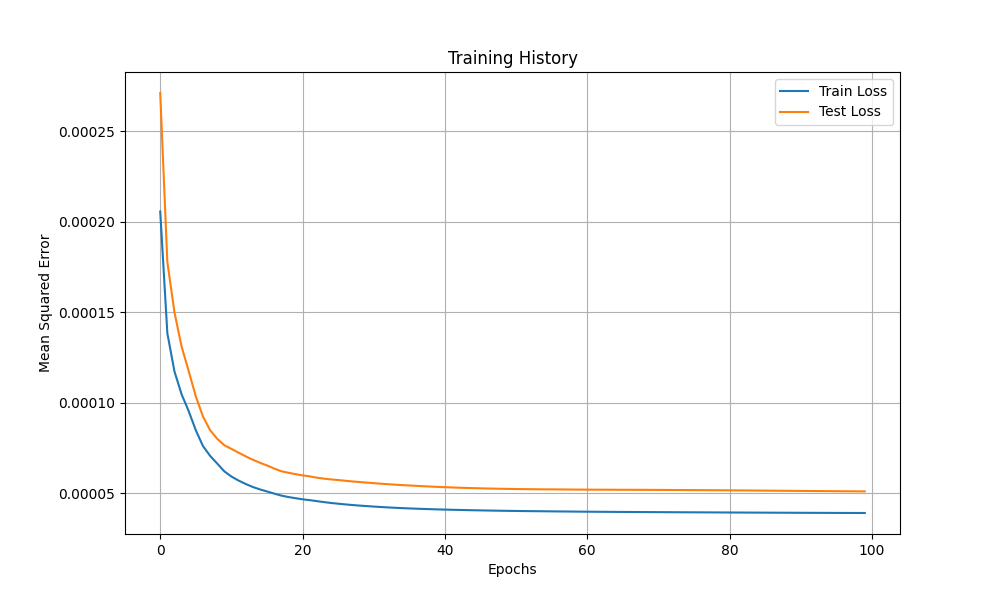

Quickstart
==================

To make sure the pacakge is properly installed,
we can start by performing a simple operation,
such as matrix multiplication:

.. code-block:: python

    from basic_deep_learning import*

    A = Matrix([[-1,1,0,3],[1,3,-1,2],[0,1,0,-1]])
    B = Matrix([[3,-1],[-4,2],[2,1],[-1,0]])

    print(A*B)

The output should be:

.. code-block:: bash

    matrix([
            [-10.0, 3.0],
            [-13.0, 4.0],
            [-3.0, 2.0]
    ])

Let us start by the following example: 
a neural network that picks up on linear patterns
based on the first five terms and predicts the next one.
In your directory, create a python file named 
``training.py``:

.. code-block:: python
    :name: training.py
    :caption: This file initialises the neural network, trains it and saves it.

    from  basic_deep_learning import*
    import random

    #A function that will generate various data of linear patterns.
    def generate_data(n=1000):
        data = []

        for i in range(n):
            start = random.randint(-10,10)
            step = random.randint(-5,5)
            seq = [start + j*step for j in range(5)]
            next_term = start + 5*step

            # Normalize by 50 to prevent floating-point errors.
            max_in_seq = max(seq)
            normalized_seq = [x / 50 for x in seq]
            normalized_next = next_term / 50

            input_matrix = Matrix([normalized_seq]).T()
            expected_output_matrix = Matrix([[normalized_next]])

            data.append((input_matrix, expected_output_matrix))

        random.shuffle(data)
        split_index = int(0.8 * len(data))
        return data[:split_index], data[split_index:]

    train, test = generate_data(2000)

    #Setting up the neural network.

    nn = MultiLayerPerceptron([5, 16, 16, 1], 'ReLU', 'tanh')

    nn.train(train, test, 0.05, 100, True) #Trainin the model.

    nn.save("nn_test.json") #Saving the model.

Once you run the script, you will see on your terminal:

.. code-block:: bash

    Epoch 1/100 | Training Loss: 0.000206 | Testing Loss: 0.000271
    Epoch 2/100 | Training Loss: 0.000138 | Testing Loss: 0.000178
    Epoch 3/100 | Training Loss: 0.000117 | Testing Loss: 0.000150
    Epoch 4/100 | Training Loss: 0.000105 | Testing Loss: 0.000131
    ...
    Epoch 98/100 | Training Loss: 0.000039 | Testing Loss: 0.000051
    Epoch 99/100 | Training Loss: 0.000039 | Testing Loss: 0.000051
    Epoch 100/100 | Training Loss: 0.000039 | Testing Loss: 0.000051

In your directory, you should be able to see 
a new directory called ``cache`` in which you will find a 
``nn_test.json`` file, a ``training_history.png`` image 
and a ``training_info.txt`` file.

.. code-block:: text
    :name: training_info.txt
    :caption: Training informations

    Epochs: 100.
    Learning rate: 0.05.
    Data size: 2000. Including:
    
       Training data size: 1600.
       Testing data size: 400.
    
    Training start date: 2025-08-31 22:27:30.774909.
    Training end date: 2025-08-31 22:29:19.166712.
    Trained in: 00 h : 01 m : 48 s : 391 ms.
    Last train loss: 3.8990712592877146e-05.
    Last test loss: 5.092510178900183e-05.

We can now create a new python file named ``loading.py``
in which we will laod the saved model and use it.

.. code-block:: python
    :name: loading.py
    :caption: This file loads the model and uses it.

    from basic_deep_learning import*

    nn = MultiLayerPerceptron.load("cache/nn_test.json")

    def predict_next_term(seq):
        normalized_input = (1/50)*Matrix([seq]).T()
        normalized_output = nn.forward_propagate(normalized_input)[0].get_entry(1,1)
        print(f"The model predicts that the next term of the sequence {seq} is {normalized_output * 50}.")

    predict_next_term([1,2,3,4,5])

Output:

.. code-block:: bash

    The model predicts that the next term of the sequence [1, 2, 3, 4, 5] is 6.121602207205266.

While the model is still not accurate, the error is pretty tolerable given the 
restricted amount of data. Further more, the accuracy could be drastically improved
by increasing the number of hidden layers, the neurons and epochs.
At last, the learning rate can be tweaked for faster convergence as well.

